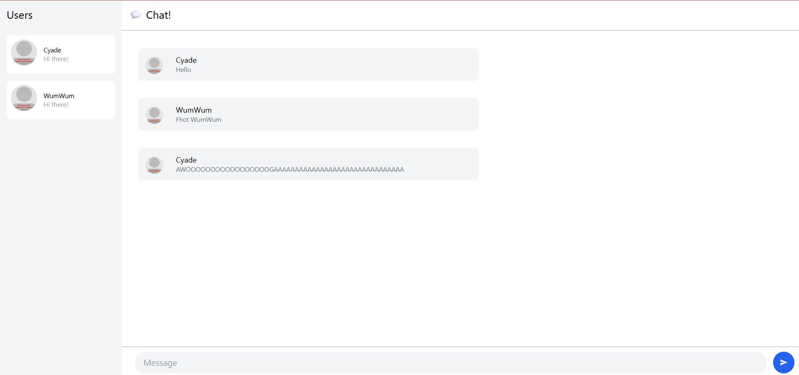

# Tutorial 10
**Nama:**   Malvin Scafi 
**NPM:**    2306152430 
**Kelas:**  AdvProg A 

## Modul 10
### Experiment 3.1 (Original Code)

### Experiment 3.2 (Creativity)

- Saya memperbarui tampilan serta menambahkan spacing pada layout keseluruhan. Daftar pengguna dilengkapi oleh indikator status online berupa titik hijau dan penanda khusus untuk diri sendiri dengan label "You". Saya juga men-design gelembung pesan agar dapat membedakan antara pesan yang diterima dan dikirimkan pengguna, avatar juga ditempatkan di sebelah pesan pengguna yaang membuat alur percakapan lebih intuitif. Header juga saya tambahkan agar menampilkan jumlah pengguna online.